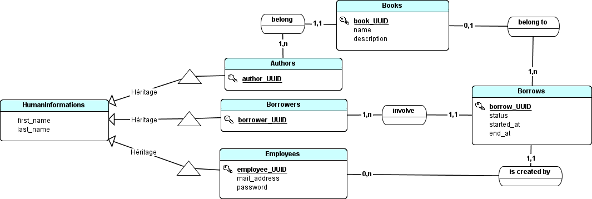
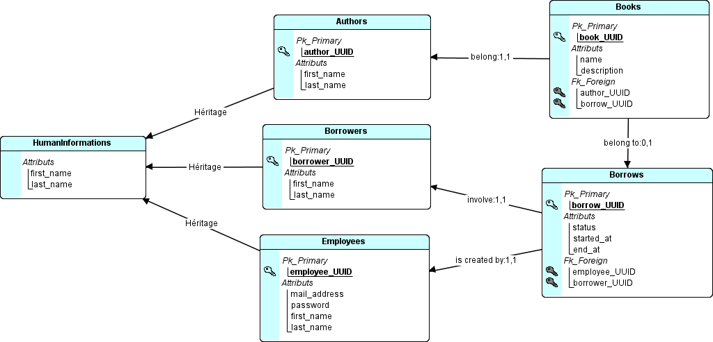

# API interne pour une Médiathéque

Vous devez créer une API pour les employés d'une médiathèque, ces employés doivent référencés chaque livre sur le site de la médiathèque pour examiner les disponibilités des livres.

## Spécifications fonctionnelles

### Employés

- Les employés doivent être composés des champs :
  - UUID (De type VARCHAR et de longueur 36 (minimale et maximale))
  - Un prénon (De type VARCHAR et de longueur 20 (maximale))
  - Un nom de famille (De type VARCHAR et de longueur 30 (maximale))
  - Une adresse e-mail (De type VARCHAR et de longueur 80 (maximale))
  - Un mot de passe (De type VARCHAR et de longueur 72 (minimale et maximale))

### Livres

- Les livres doivent être composés des champs :
  - UUID (De type VARCHAR et de longueur 36 (minimale et maximale))
  - Un nom (De type VARCHAR et de longueur 40 (maximale))
  - Une description (De type TEXT et de longueur 500 (maximale))
  - L'UUID d'un autheur

### Autheurs

- Les autheurs doivent être composés des champs :
  - UUID (De type VARCHAR et de longueur 36 (minimale et maximale))
  - Un prénon (De type VARCHAR et de longueur 20 (maximale))
  - Un nom de famille (De type VARCHAR et de longueur 30 (maximale))

### Emprunteurs

- Les emprunteurs doivent être composés des champs : 
  - UUID (De type VARCHAR et de longueur 36 (minimale et maximale))
  - Un prénon (De type VARCHAR et de longueur 20 (maximale))
  - Un nom de famille (De type VARCHAR et de longueur 30 (maximale))
  
### Emprunts

- Les emprunts doivent être composés des champs :
  - UUID (De type VARCHAR et de longueur 36 (minimale et maximale))
  - L'UUID d'un livre (De type VARCHAR et de longueur 36 (minimale et maximale))
  - L'UUID d'un emprunteur (De type VARCHAR et de longueur 36 (minimale et maximale))
  - Une date de début (De type DATE)
  - Une date de fin (De type DATE)
  - Un état (De type INT >= 0 ou <= 2)

## Merise

### MCD

  

### MLD

  

